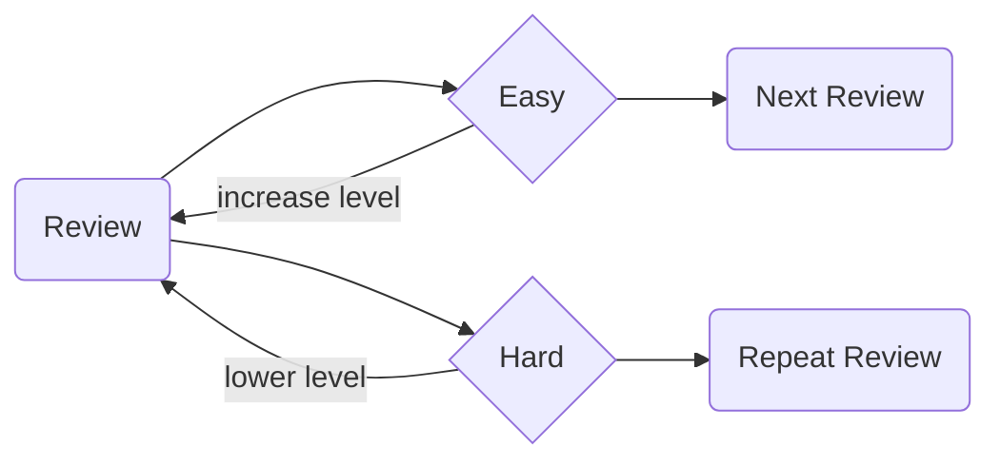

# 🌸 Katsuyou


> Katsuyou is an application to learn and practice Japanese verb conjugations, and pick up new vocabulary.

## Development

#### 1. Prerequisites

Depending on what system you're running it on you may need to install:

- Xcode
- Android Studio
- Expo Go (on your mobile device)

#### 2. Running

Katsuyou is built using [Expo]() so installing and running the server is easy to do.

```
yarn
yarn start
```

From here, you can start the simulator of your choice, e.g. hit `i` to start the iOS Simulator.

## Application Overview

Since this project is a learning experience, all of the underlying language rules, as well as the UI are written from scratch. I've made use of some libraries to ease development.

#### 1. Conjugator

The conjugator focuses on taking a `verb` and an `inflection` and returning it in that form. For example, `喋る` in the `past` inflection would be `喋った`.

The full list of supported inflections are:

- non-past
- non-past polite
- past
- past polite
- potential
- te

Planning to support:

- passive
- causative
- causative passive

These are largely based on the inflections on [Jisho](https://jisho.org/), as they offer a good range, and don't repeat the rules too much.

#### 2. Reviews

Reviews are be drawn from the verbs file in order of frequency (lessons). A reviews consists of the following attributes:

| property   | type       | description                                                 |
| ---------- | ---------- | ----------------------------------------------------------- |
| slug       | string     | the canoncial identifier for a verb such as 食べる          |
| level      | Level      | an enum from beginner to expert                             |
| inflection | Inflection | an enum for inflections such as NonPast, Past, Polite, etc. |
| dueAt      | string     | ISO-8601 formatted datetime when the next review is due     |

When you first start a practice session, we will generate the first review using a verb with a random inflection. Each time you progress easily it will increase the review's level, and set a scaling due at time in the future. If you find the review difficult, it will set a due at time within 1 minute so you can re-review it until it is easy.



#### Wrap Up Mode

If you're done practicing the day, you can enter wrap up mode to finish out any lessons that you had marked difficult.

#### Issues

Please add any outstanding bugs, or features to the Github issues page.
